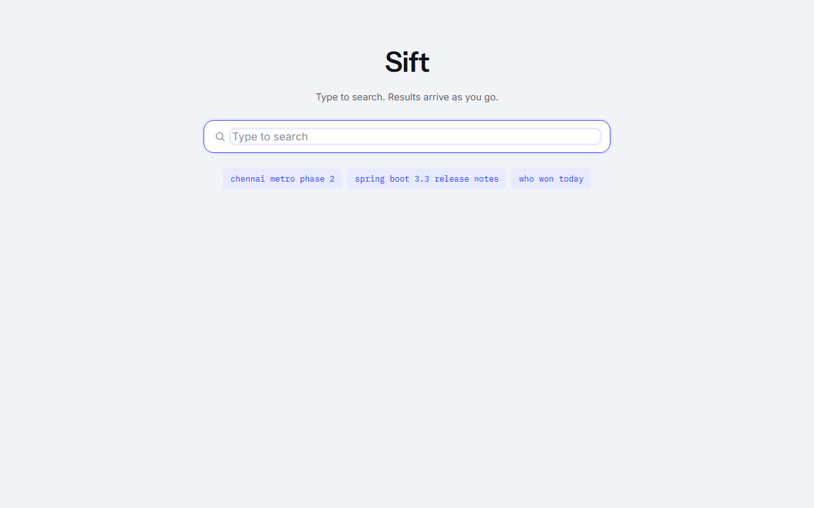
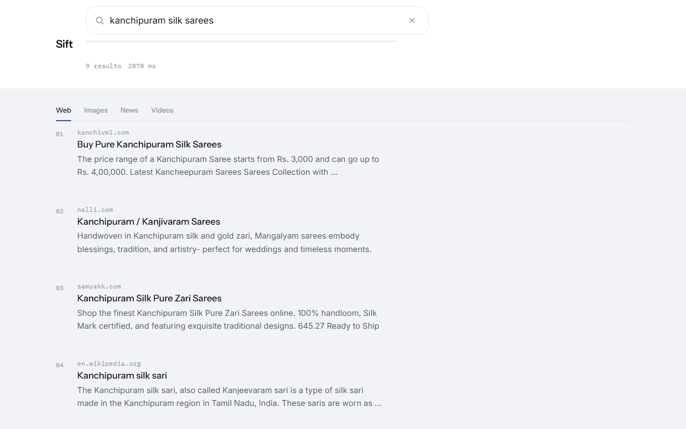
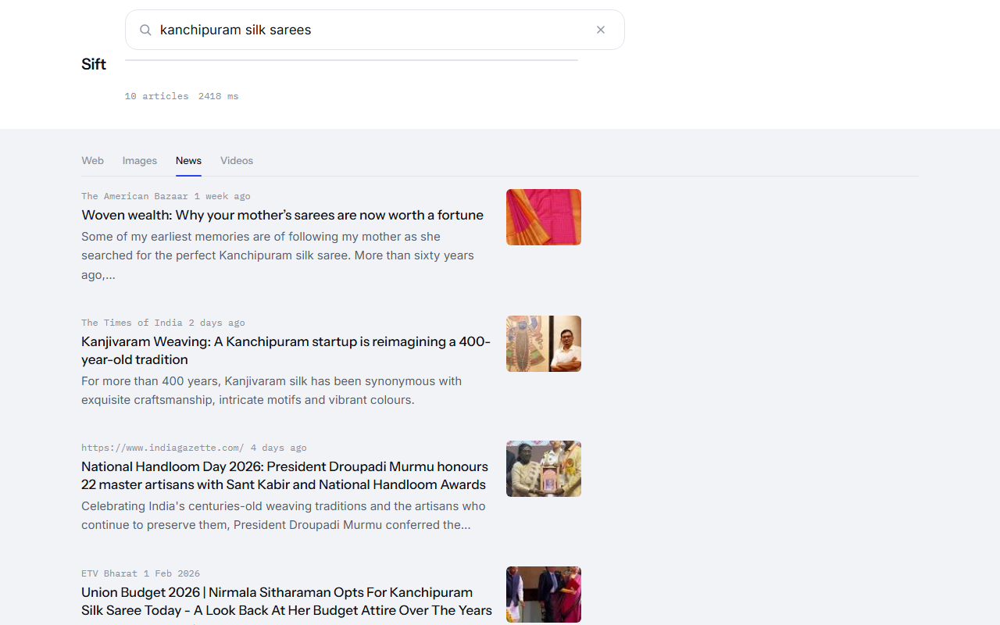
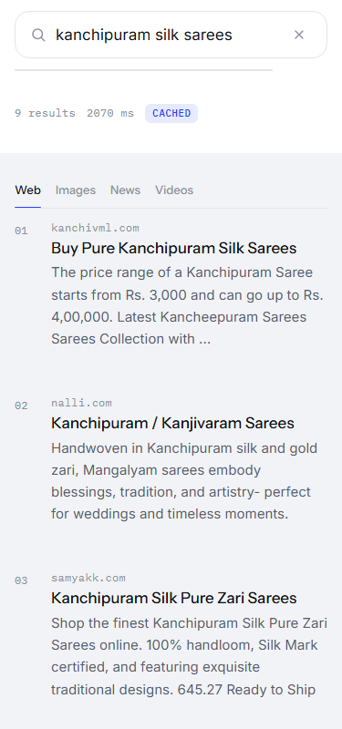
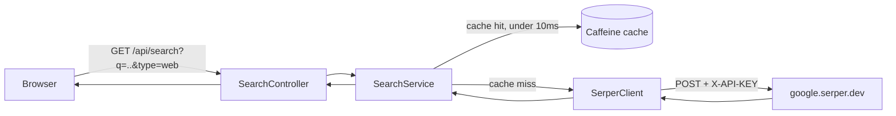

<div align="center">


<br/>


</div>

## What this is

Sift is a search engine you run yourself. Type a query and results start arriving before you've finished typing — no page reloads, no spinner. It has four modes (web, images, news, video), plus the answer box and knowledge panel you'd expect from a real engine. Under the hood, a small Spring Boot server holds the one secret that matters — the [Serper](https://serper.dev) API key — and a React frontend renders whatever comes back. Ship it as a single Java program; the only thing you supply is that key.

## Contents

- [Screenshots](#screenshots)
- [How it works](#how-it-works)
- [Tech stack](#tech-stack)
- [Project structure](#project-structure)
- [Quick start](#quick-start)
- [API](#api)
- [Deployment](#deployment)
- [Environment variables](#environment-variables)

## Screenshots

| Idle | Web results |
|---|---|
|  |  |

| Images | News |
|---|---|
|  |  |

| Videos | Mobile (375px) |
|---|---|
|  |  |

## How it works



Every request goes through Spring Boot — the frontend never talks to Serper directly, and the API key never leaves the server. Repeat searches are served from a 5-minute Caffeine cache, which is why the `Cached` chip shows up almost instantly on the second identical query (see the mobile screenshot above).

## Tech stack

| Layer | Choice |
|---|---|
| Backend | Java 21, Spring Boot 3.3, `RestClient`, Caffeine cache |
| Frontend | React 18, Vite, plain CSS (no framework, no Tailwind) |
| Search provider | [Serper](https://serper.dev) (Google Search API) |
| Deployment | One runnable JAR · Docker (multi-stage) · Vercel (static + proxy) |

## Project structure

```
Sift/
├── backend/                       Spring Boot API
│   └── src/main/java/dev/sift/search/
│       ├── client/                 SerperClient, SerperException
│       ├── config/                 RestClientConfig, WebConfig (CORS)
│       ├── dto/                    Java records — the API contract
│       ├── service/                SearchService (cache), SerperMapper
│       └── web/                    SearchController, ApiExceptionHandler
├── frontend/                      React + Vite
│   ├── api/[...path].js            Vercel proxy → backend (see Deployment)
│   └── src/
│       ├── components/             SearchBar, Tabs, ResultList, ...
│       ├── App.jsx                 all state: debounce, abort, URL sync
│       ├── api.js                  fetch wrapper
│       └── index.css               the design system
├── docs/                          screenshots + banner
├── scripts/dev.ps1                one command, both servers (Windows)
└── Dockerfile                     multi-stage build → single JAR
```

## Quick start

Two terminals:

```bash
cd backend  && SERPER_API_KEY=xxx ./mvnw spring-boot:run     # :8080
cd frontend && npm install && npm run dev                    # :5173
```

Open `http://localhost:5173`. On Windows, `.\scripts\dev.ps1` does both at once, reading the key from a `.env` file at the repo root.

**Single artifact, production build:**

```bash
cd frontend && npm run build        # → backend/src/main/resources/static
cd backend  && ./mvnw clean package # → target/sift-1.0.0.jar
SERPER_API_KEY=xxx java -jar backend/target/sift-1.0.0.jar   # :8080 serves everything
```

## API

| Method | Path | Notes |
|---|---|---|
| `GET` | `/api/search?q=&type=&page=` | `type`: `web` \| `images` \| `news` \| `videos` (default `web`). `page`: 1–10 (default 1). |
| `GET` | `/api/health` | Liveness check → `{"status":"up"}` |

A search response always carries `query`, `type`, `page`, `tookMs`, `cached`, and the result arrays for the requested type — missing Serper blocks (`answerBox`, `knowledgeGraph`, …) come back `null`, never a placeholder or an error.

## Deployment

**Docker** — one image, everything included:

```bash
docker build -t sift .
docker run -p 8080:8080 -e SERPER_API_KEY=xxx sift
```

`server.port` reads `$PORT`, so Render, Railway and Fly all bind correctly with no extra config.

**Vercel** — the frontend deploys as a static build; `frontend/api/[...path].js` forwards `/api/*` to your backend (hosted separately, since Vercel doesn't run a persistent JVM). The Serper key still never touches Vercel.

1. Deploy `backend/` (or the root `Dockerfile`) to Render/Railway/Fly and note its URL.
2. Vercel → **New Project** → this repo → **Root Directory**: `frontend` (Vite preset auto-detected).
3. Add one env var on the Vercel project: `BACKEND_URL` = your backend's URL.

## Environment variables

| Variable | Where | Required |
|---|---|---|
| `SERPER_API_KEY` | backend host (local, Docker, Render/Railway/Fly) | yes |
| `BACKEND_URL` | Vercel project (frontend only) | only if deploying the frontend on Vercel |

Copy `.env.example` to `.env` for local reference — Spring Boot reads `SERPER_API_KEY` from the process environment, not from the file directly; `scripts/dev.ps1` loads it for you.

<div align="center">

<sub>Built on Java 21 · Spring Boot · React · Vite — one JAR, one port.</sub>

</div>
